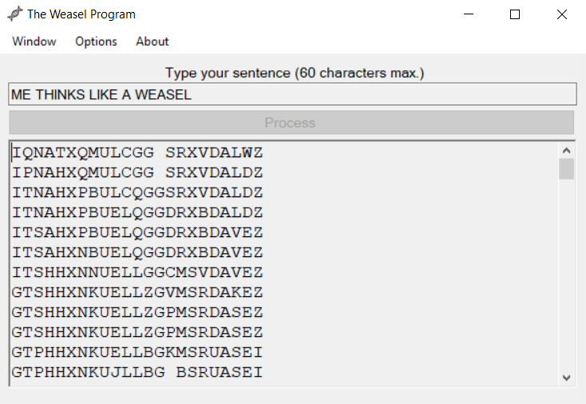

# The Weasel Program (GUI)
A graphical interface for The Weasel Program.

The Weasal Program is an illustration used in the book 'The Blind Watchmaker' as an attempt to explain Evolution by Natural Selection.
The algorithm starts off with a random string and mutates it until a specific goal-string is found. A selective process selects the string that matches the goal-string the most after the end of each cycle.

This open-source program lets the user experiment and simulate this concept. The interface prompts a simple sentence (only uppercase Latin letters and whitespaces are currently accepted) and shows the whole procedure to reach the goal-string.

The user can change the number of mutations occuring at each cycle and the likelihood of character mutation.

New functionalities are intended to be added soon.

# Overview
Demonstration of the program with the sentence 'ME THINKS LIKE A WEASEL'. Default parameters were used.

